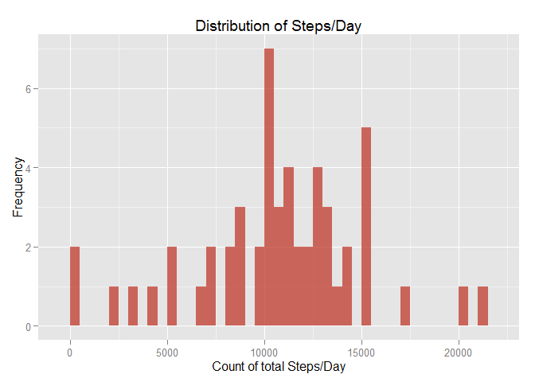

# Reproducible Research: Peer Assessment 1

```r
setwd("C:/git/RepData_PeerAssessment1")
```
## Loading and preprocessing the data

```r
library(dplyr)
```

```
## 
## Attaching package: 'dplyr'
## 
## The following object is masked from 'package:stats':
## 
##     filter
## 
## The following objects are masked from 'package:base':
## 
##     intersect, setdiff, setequal, union
```

```r
activity <- read.csv("activity.csv")
activity[is.na(activity)] <- 0
```

## What is mean total number of steps taken per day?

```r
activity_sum <- activity %>%
  group_by(date) %>%
    summarise(count = sum(steps), mean_steps= mean(steps), median_steps=median(steps))
```

###Histogram here

```r
library(ggplot2)
bar <- ggplot(activity_sum, aes(x=date, y=count)) + geom_bar(stat="identity") 
bar
```

 

##Mean and median total number of steps taken per day


```r
summary <- activity_sum %>% 
                  select(date, mean_steps, median_steps)

summary
```

```
## Source: local data frame [61 x 3]
## 
##          date mean_steps median_steps
## 1  2012-10-01    0.00000            0
## 2  2012-10-02    0.43750            0
## 3  2012-10-03   39.41667            0
## 4  2012-10-04   42.06944            0
## 5  2012-10-05   46.15972            0
## 6  2012-10-06   53.54167            0
## 7  2012-10-07   38.24653            0
## 8  2012-10-08    0.00000            0
## 9  2012-10-09   44.48264            0
## 10 2012-10-10   34.37500            0
## ..        ...        ...          ...
```
