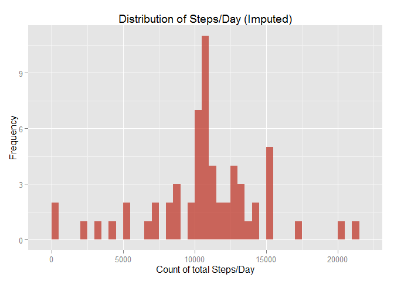
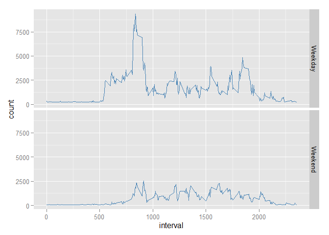

# Reproducible Research: Peer Assessment 1
This is the R Markdown document which describes the process of loading, pre-processing and visualizing the quantified self data for a 2 month period of a subject. 
Load the libraries (dplyr & ggplot)

```r
library(dplyr)
```

```
## 
## Attaching package: 'dplyr'
## 
## The following object is masked from 'package:stats':
## 
##     filter
## 
## The following objects are masked from 'package:base':
## 
##     intersect, setdiff, setequal, union
```

```r
library(ggplot2)
```
## Loading and preprocessing the data
1. Load the dplyr library, and the data which is in the csv file. 

```r
activity <- read.csv("activity.csv")
```
2. Pre-process : The original data has NA's and they will be ignored for the initial part of the calculations. The mean and median and the total count is also calculated. 

```r
activity_comp <- activity[complete.cases(activity),]

activity_sum <- activity_comp %>%
  group_by(date) %>%
    summarise(count = sum(steps), mean_steps= mean(steps), median_steps=median(steps))
```


## What is mean total number of steps taken per day?

1. Histogram of total number of steps taken per day


```r
hist(activity_sum$count, xlab="No.Steps (Day)", ylab="Frequency", main="Histogram of Steps/Day", col="steelblue")
```

 

2. Mean and median total number of steps taken per day


```r
summary <- activity_sum %>% 
                  select(date, mean_steps, median_steps)

summary
```

```
## Source: local data frame [53 x 3]
## 
##          date mean_steps median_steps
## 1  2012-10-02    0.43750            0
## 2  2012-10-03   39.41667            0
## 3  2012-10-04   42.06944            0
## 4  2012-10-05   46.15972            0
## 5  2012-10-06   53.54167            0
## 6  2012-10-07   38.24653            0
## 7  2012-10-09   44.48264            0
## 8  2012-10-10   34.37500            0
## 9  2012-10-11   35.77778            0
## 10 2012-10-12   60.35417            0
## ..        ...        ...          ...
```

##Average daily activity pattern
1. Time series plot (Interval vs Avg. Steps taken across days)

```r
activity_interval <- activity_comp %>%
  group_by(interval) %>%
    summarise(mean_steps= mean(steps))

max <- max(activity_interval$mean_steps) 

ggplot(activity_interval,aes(interval, mean_steps)) +
  geom_line() 
```

 

2. Which 5-minute interval, on average across all the days in the dataset, contains the maximum number of steps?


```r
max_interval <- activity_interval %>% filter(mean_steps == max) %>% select(interval)
```

5-minute interval that has the average maximum number of steps is 835. 

##Imputing missing values

```r
activity2 <- read.csv("activity.csv")
```

1. Calculate and report the total number of missing values in the dataset (i.e. the total number of rows with NAs)

```r
total_nas <- sum(is.na(activity2$steps))
```
Total missing values in the dataset are 2304. 

2. Devise a strategy for filling in all of the missing values in the dataset. The strategy does not need to be sophisticated.
3.Create a new dataset that is equal to the original dataset but with the missing data filled in.

Imputing missing values with overall mean and creation a new dataset.

```r
activity2[is.na(activity2)] <- mean(activity2$steps, na.rm = TRUE)
```

4. Make a histogram of the total number of steps taken each day and Calculate and report the mean and median total number of steps taken per day. 


```r
activity2_sum <- activity2 %>%
  group_by(date) %>%
    summarise(count = sum(steps), mean_steps= mean(steps), median_steps=median(steps))


hist(activity2_sum$count, xlab="No.Steps (Day)", ylab="Frequency", main="Histogram of Steps/Day", col="steelblue")
```

 

```r
summary <- activity2_sum %>% select(date, mean_steps, median_steps)

summary
```

```
## Source: local data frame [61 x 3]
## 
##          date mean_steps median_steps
## 1  2012-10-01   37.38260      37.3826
## 2  2012-10-02    0.43750       0.0000
## 3  2012-10-03   39.41667       0.0000
## 4  2012-10-04   42.06944       0.0000
## 5  2012-10-05   46.15972       0.0000
## 6  2012-10-06   53.54167       0.0000
## 7  2012-10-07   38.24653       0.0000
## 8  2012-10-08   37.38260      37.3826
## 9  2012-10-09   44.48264       0.0000
## 10 2012-10-10   34.37500       0.0000
## ..        ...        ...          ...
```

The overall shape of the histogram remains the same with the exception of the Frequency being higher on the imputed values (imputed with the overall mean). 

4. Do these values differ from the estimates from the first part of the assignment? What is the impact of imputing missing data on the estimates of the total daily number of steps?


```r
imp <- select(activity2_sum, date, count )
colnames(imp) <- c("date", "imp_count")

orig <- select(activity_sum, date, count )
colnames(orig) <- c("date", "orig_count")

join <- left_join(imp, orig, by="date")

mutate <- mutate(join, diff=(imp_count-orig_count))
```

The difference between original and imputed values

```r
mutate
```

```
## Source: local data frame [61 x 4]
## 
##          date imp_count orig_count diff
## 1  2012-10-01  10766.19         NA   NA
## 2  2012-10-02    126.00        126    0
## 3  2012-10-03  11352.00      11352    0
## 4  2012-10-04  12116.00      12116    0
## 5  2012-10-05  13294.00      13294    0
## 6  2012-10-06  15420.00      15420    0
## 7  2012-10-07  11015.00      11015    0
## 8  2012-10-08  10766.19         NA   NA
## 9  2012-10-09  12811.00      12811    0
## 10 2012-10-10   9900.00       9900    0
## ..        ...       ...        ...  ...
```

##Are there differences in activity patterns between weekdays and weekends?
1. Create a new factor variable in the dataset with two levels -- "weekday" and "weekend" indicating whether a given date is a weekday or weekend day.


```r
activity2 <- read.csv("activity.csv")
activity2[is.na(activity2)] <- mean(activity2$steps, na.rm = TRUE)

activity2$date <- as.Date(activity2$date)

activity2 <- mutate(activity2, weekday = as.factor(ifelse(weekdays(activity2$date) %in% c("Saturday", "Sunday"), "Weekend", "Weekday")))
```
Pre-processing for the time series plot in the next step. 

```r
activity2_weekend <- activity2 %>%
  group_by(weekday, interval) %>%
    summarise(count = sum(steps))
```

2. Make a panel plot containing a time series plot (i.e. type = "l") of the 5-minute interval (x-axis) and the average number of steps taken, averaged across all weekday days or weekend days (y-axis)

```r
 g <- ggplot(activity2_weekend,aes(interval, count))  
 g + geom_line(col="steelblue") + facet_grid(weekday ~ .)
```

 
