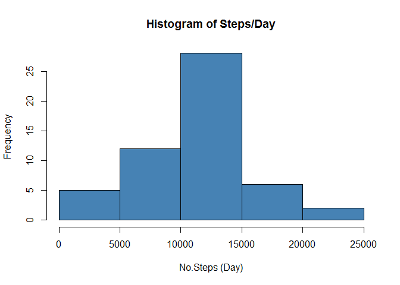
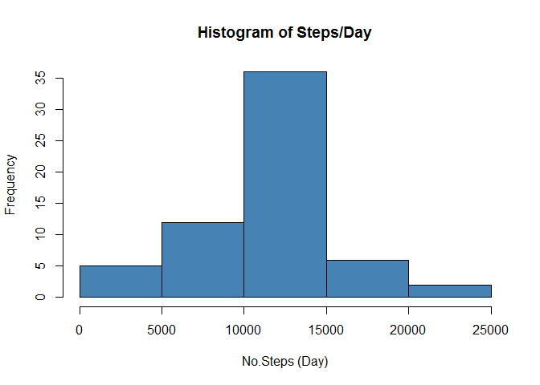

# Reproducible Research: Peer Assessment 1
## Loading and preprocessing the data

```r
library(dplyr)
```

```
## 
## Attaching package: 'dplyr'
## 
## The following object is masked from 'package:stats':
## 
##     filter
## 
## The following objects are masked from 'package:base':
## 
##     intersect, setdiff, setequal, union
```

```r
activity <- read.csv("activity.csv")
activity[is.na(activity)] <- 0
```

## What is mean total number of steps taken per day?

```r
activity_sum <- activity %>%
  group_by(date) %>%
    summarise(count = sum(steps), mean_steps= mean(steps), median_steps=median(steps))
```

###Histogram here

```r
library(ggplot2)
bar <- ggplot(activity_sum, aes(x=date, y=count)) + geom_bar(stat="identity") 
bar
```

 

##Mean and median total number of steps taken per day


```r
summary <- activity_sum %>% 
                  select(date, mean_steps, median_steps)

summary
```

```
## Source: local data frame [61 x 3]
## 
##          date mean_steps median_steps
## 1  2012-10-01    0.00000            0
## 2  2012-10-02    0.43750            0
## 3  2012-10-03   39.41667            0
## 4  2012-10-04   42.06944            0
## 5  2012-10-05   46.15972            0
## 6  2012-10-06   53.54167            0
## 7  2012-10-07   38.24653            0
## 8  2012-10-08    0.00000            0
## 9  2012-10-09   44.48264            0
## 10 2012-10-10   34.37500            0
## ..        ...        ...          ...
```

##Average daily activity pattern

```r
activity_interval <- activity %>%
  group_by(interval) %>%
    summarise(mean_steps= mean(steps))

max <- max(activity_interval$mean_steps) # Find a dplyr way to do this.
max_interval <- activity_interval %>% filter(mean_steps == max) %>% select(interval)

ggplot(activity_interval,aes(interval, mean_steps)) +
  geom_line() 
```

 

```r
#+ geom_text(data=activity_interval[max_interval, max], label="note" , vjust=1, colour="red")
```

######5-minute interval that has the average maximum number of steps is 835


##Imputing missing values

```r
activity2 <- read.csv("activity.csv")
total_nas <- sum(is.na(activity$steps))

activity2[is.na(activity2)] <- mean(activity2$steps, na.rm = TRUE)

library(ggplot2)

activity2_sum <- activity2 %>%
  group_by(date) %>%
    summarise(count = sum(steps), mean_steps= mean(steps), median_steps=median(steps))


bar <- ggplot(activity2_sum, aes(x=date, y=count)) + geom_bar(stat="identity") 
bar
```

 

```r
summary <- activity2_sum %>% 
                  select(date, mean_steps, median_steps)

summary
```

```
## Source: local data frame [61 x 3]
## 
##          date mean_steps median_steps
## 1  2012-10-01   37.38260      37.3826
## 2  2012-10-02    0.43750       0.0000
## 3  2012-10-03   39.41667       0.0000
## 4  2012-10-04   42.06944       0.0000
## 5  2012-10-05   46.15972       0.0000
## 6  2012-10-06   53.54167       0.0000
## 7  2012-10-07   38.24653       0.0000
## 8  2012-10-08   37.38260      37.3826
## 9  2012-10-09   44.48264       0.0000
## 10 2012-10-10   34.37500       0.0000
## ..        ...        ...          ...
```

### Comparing the differences between the non-imputed and imputed data sets

```r
imp <- select(activity2_sum, date, count )
orig <- select(activity_sum, date, count )
```
###Weekdays vs Weekends

```r
activity2 <- read.csv("activity.csv")
activity2[is.na(activity2)] <- mean(activity2$steps, na.rm = TRUE)

activity2$date <- as.Date(activity2$date)

activity2 <- mutate(activity2, weekday = as.factor(ifelse(weekdays(activity2$date) %in% c("Saturday", "Sunday"), "Weekend", "Weekday")))

activity2_weekend <- activity2 %>%
  group_by(weekday, interval) %>%
    summarise(count = sum(steps))


 g <- ggplot(activity2_weekend,aes(interval, count))  
 g + geom_line(col="steelblue") + facet_grid(weekday ~ .)
```

 
